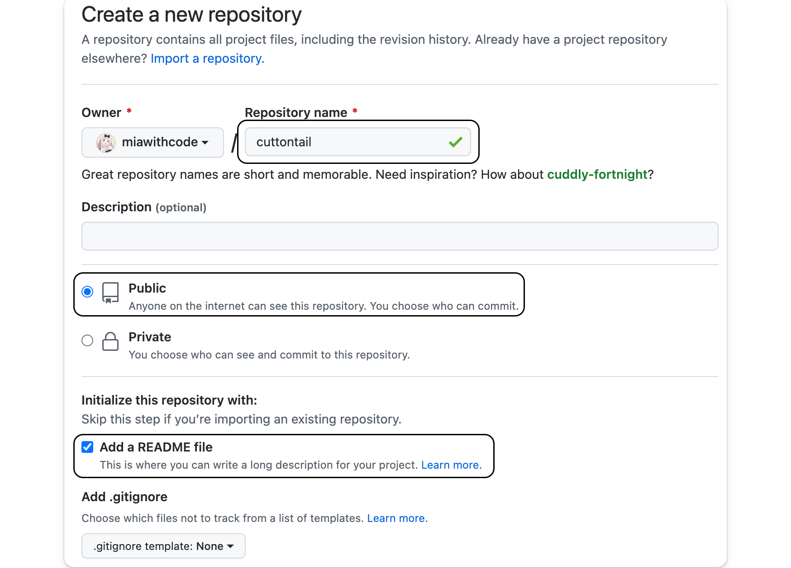
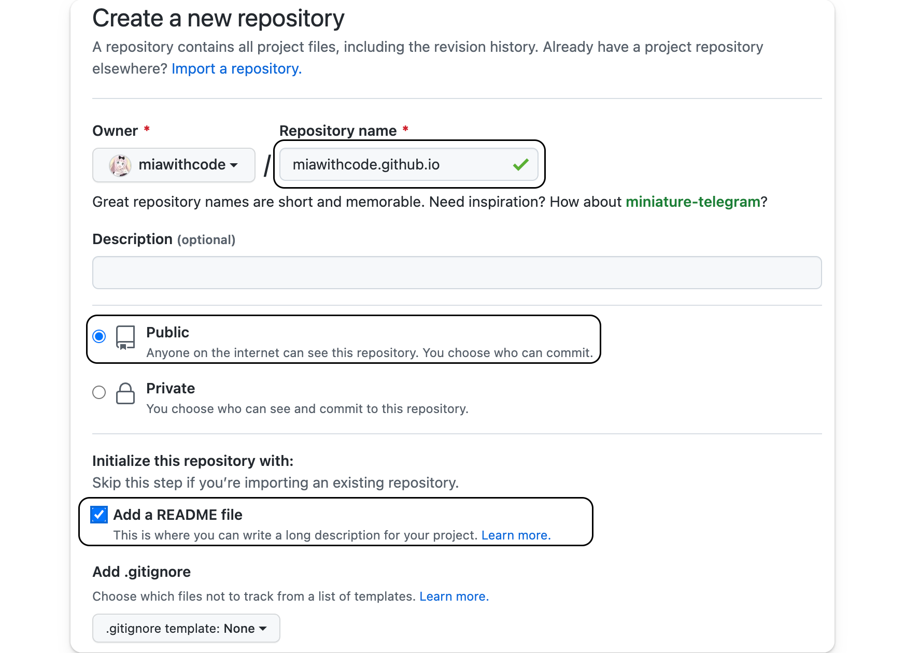
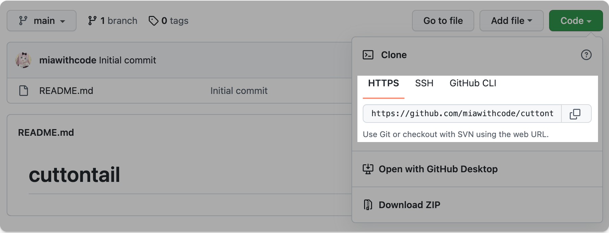
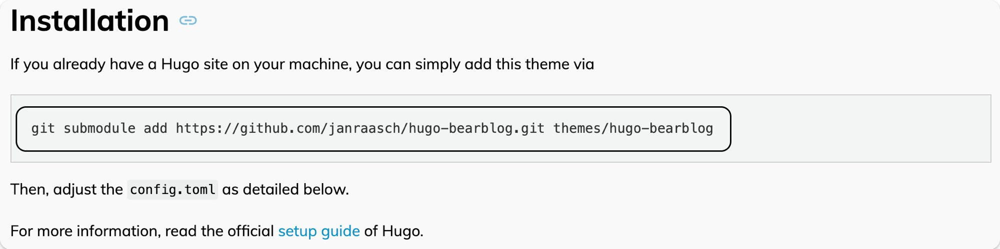
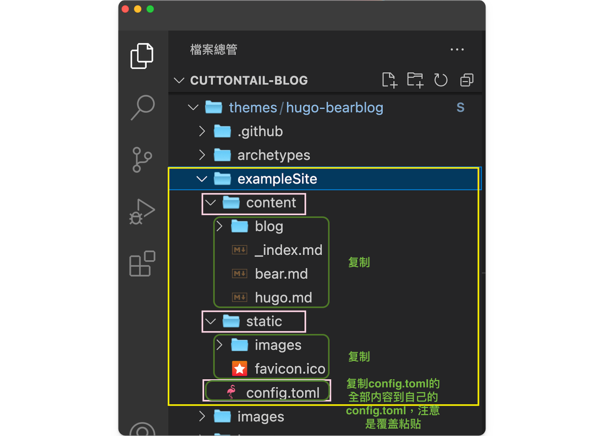
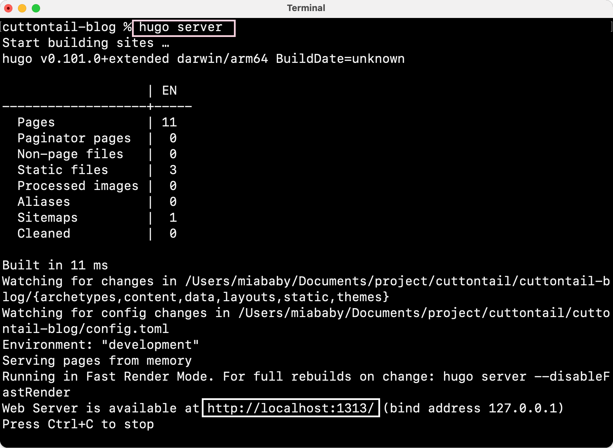
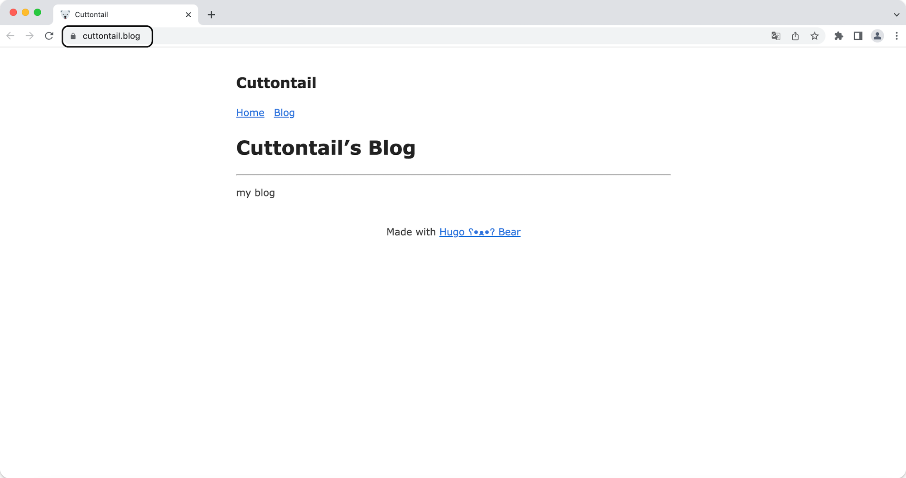

## 1. 概念，搭建思路和运行环境

### 1.1 什么是 GitHub Pages？

[GitHub Pages](https://pages.github.com/) 是一组静态网页集合（Static Web Page），这些静态网页由 [GitHub](https://github.com/) 托管（host）和发布，所以是 GitHub + Pages。

### 1.2 什么是 Hugo？

[Hugo](https://gohugo.io/) 是用 Go 语言写的静态网站生成器（Static Site Generator）。可以把 Markdown 文件转化成 HTML 文件。

### 1.3 网站搭建思路

1. 创建 2 个 GitHub 仓库
   - **博客源仓库**：储存所有 Markdown 源文件（博客内容），和博客中用到的图片等。
   - **GitHub Pages 仓库**：储存由 Hugo 从Markdown 文件生成的 HTML 文件。
2. 将在**博客源仓库**中 Hugo 生成的静态 HTML 文件部署到远端 **GitHub Pages 仓库**中。

### 1.4 运行环境


这篇教程假设你已经：


1. 了解基本的终端命令行知识，如：`cd`, `ls`
2. 安装了 [Git](https://git-scm.com/)，并且了解基本的 Git 知识
3. 有一个  [GitHub](https://github.com/)账号
4. 有自己偏好的代码编辑器（我使用的是 [VS Code](https://code.visualstudio.com/)）

---

## 2. 安装 Hugo

1. 这里使用包管理器安装 Hugo，我的操作系统是 Mac OS，所以使用 Homebrew 安装 Hugo。如果你使用的是 Windows 或 Linux，可以根据 Hugo 文档提示的方式安装：[Hugo 文档：Install Hugo](https://gohugo.io/getting-started/installing/)

   ```shell
   brew install hugo
   ```

2. 查看 Hugo 是否安装成功，显示 Hugo 版本号代表 Hugo 安装成功。
   ```shell
   hugo version
   ```

---

## 3. 创建 GitHub 仓库

### 3.1 创建博客源仓库

1. 命名**博客源仓库**（whatever you want）
2. 勾选 **Public**，设置为公开仓库。
3. 勾选添加 **README** 文件



### 3.2 创建 GitHub Page 仓库

1. 命名 **GitHub Pages** 仓库，这个仓库必须使用特殊的命名格式 `<username.github.io>`， `<username>` 是自己的 GitHub 的用户名。
2. 勾选 **Public**，设置为公开仓库。
3. 勾选添加 **README** 文件，这会设置 `main` 分支为仓库的默认主分支，这在后面提交推送博客内容时很重要。



---

## 4. 克隆博客源仓库到本地

1. 打开想要在本地储存项目的文件夹（比如我的项目的文件夹是 `project` ）
   ```shell
   cd project
   ```
2. 克隆**博客源仓库**到项目文件夹，克隆时使用的 HTTPS 仓库链接在这里查看：

   ```shell
   git clone https://github.com/miawithcode/cuttontail.git
   ```

   

---

## 5. 使用 Hugo 创建网站

1. 进入刚刚克隆下来的**博客源仓库**文件夹（比如：我的博客源仓库文件夹名是 `cuttontail`，则`cd cuttontail` ），在这个文件夹里用 Hugo 创建一个网站文件夹。
2. 用 Hugo 创建网站文件夹的命令是 `hugo new site 网站名字`。(比如，我的命名是 `cuttontail-blog`)

   ```shell
   cd cuttontail
   hugo new site cuttontail-blog
   ```

   

3. 用 Hugo 创建的网站共有 7 个文件夹和 1 个文件，这些文件分别代表：
   

   - **archetypes**：存放用 hugo 命令新建的 Markdown 文件应用的 front matter 模版
   - **content**：存放内容页面，比如「博客」、「读书笔记」等
   - **layouts**：存放定义网站的样式，写在`layouts`文件下的样式会覆盖安装的主题中的 `layouts`文件同名的样式
   - **static**：存放所有静态文件，如图片
   - **data**：存放创建站点时 Hugo 使用的其他数据
   - **public**：存放 Hugo 生成的静态网页
   - **themes**：存放主题文件
   - **config.toml**：网站配置文件

---

## 6. 安装和配置 Hugo 主题

### 6.1 选择 Hugo 主题

可以从 [Hugo 社区提供的主题](https://themes.gohugo.io/)中选择一个喜欢的主题应用在自己的网站中。

### 6.2 安装 Hugo 主题

1.  一般在你选择的 Hugo 主题的文档中，都会给出「如何安装这个主题」的命令，比如我选用的 **Hugo Bear Blog** 的文档中给出：

    

2.  打开刚刚用 Hugo 创建的网站文件夹（我的是 cuttontail-blog），在终端粘贴文档中给出的安装命令。
    
3.  这时可以看到在`themes`文件夹中，多出了刚刚安装的主题文件，代表主题安装成功。
    

### 6.3 配置 Hugo 主题

1. 一般安装的 Hugo 主题的文件结构中都会有 `exampleSite` 文件夹，也是你在选择主题时参考的网站 demo。
2. **把 `exampleSite` 的文件复制到站点目录，在此基础上进行基础配置**。
   非常推荐这么做，这样做能解决很多「为什么明明跟教程一步一步做下来，显示的结果却不一样？」的疑惑。（这主要是因为不同的主题模版配置文件不同导致的。）
3. 在把`exampleSite`文件复制到站点目录时，请根据**对应**文件夹进行复制文件

   - 比如`exampleSite`下有 `content` ,  `static`  和  `config.toml` 3 个文件，就找到你自己的站点跟目录下这对应的三个文件。在把对应目录中的内容分别复制过去。
     
     

4. 其中在复制`config.toml`的内容时要注意：
   - **baseURL**
     ```shell
     baseURL = "https://example.com/" #把https://example.com/改成自己的域名
     ```
     如果你没有在 GitHub Pages 中设置自定义域名，这里的域名应该填 `https://<username>.github.io/` （⚠️ 注意：最后的`/`不要忘了加）
   - **themes**
     ```shell
     themes = "你选择的主题名字"。 #这一行命令代表启用你安装的主题
     ```
     在 `config.toml` 中输入这行命令才能启用安装的主题，不过一般这行命令在你复制 `exampleSite` 的配置文件信息时，主题作者已经写好了这行。

---

## 7. 用 Hugo 创建文章

用 Hugo 创建一篇文章的命令是:

```shell
hugo new xxx.md
```

用这个命令创建的 Markdown 文件会套用 `archetypes` 文件夹中的 front matter 模版，在空白处用 Markdown 写入内容。


其中，`draft: true`代表这篇文章是一个草稿，Hugo 不会显示草稿，要在主页显示添加的文章，可以设置 `draft: false`；或者直接删掉这行。

---

## 8. 本地调试和预览

1. 在发布到网站前可以在本地预览网站或内容的效果，运行命令：
   ```shell
   hugo server
   ```
   
2. 也可以在本地编辑 Markdown 文件时，通过 `hugo server` 来实时预览显示效果。
3. `hugo server`  运行成功后，可以在 `http://localhost:1313/` 中预览网站
   

---

## 9. 发布内容

1. `hugo`  命令可以将你写的 Markdown 文件生成静态 HTML 网页，生成的 HTML 文件默认存放在 `public` 文件夹中。

   ```shell
   hugo
   ```

   

2. 因为`hugo`  生成的静态 HTML 网页文件默认存放在  `public`  文件中，所以推送网页内容只需要把  `public`  中的 HTML 网页文件发布到 GitHub Pages 仓库中。
3. 将  `public`  文件夹初始化为 Git 仓库，并设置默认主分支名为  `main`。这么做的原因是：

   - GitHub 创建仓库时生成的默认主分支名是 `main`
   - 用 `git init` 初始化 Git 仓库时创建的默认主分支名是 `master`
   - 将 `git init` 创建的 `master` 修改成 `main` ，再推送给远端仓库 `<username>.github.io` ，这样才不会报错。

   ```shell
   cd public
   git init -b main
   ```

   

4. 将 `public`  文件夹关联远程 GitHub Pages 仓库，使用 GitHub Pages 仓库的 SSH 链接。

   - （ ⚠️ 注意：要让 SSH 链接起作用，需要你添加过 SSH Key。如果你没有设置过 SSH Key，请参考[如何在 Mac 上为 GitHub 设置 SSH Key](/blog/how-to-add-ssh-key-to-github-on-mac/)）

   - **GitHub Pages 仓库的 SSH 链接可以在这里查看：**
     

   ```shell
   git remote add origin git@github.com:miawithcode/miawithcode.github.io.git
   ```

   

5. 推送**博客源仓库**的  `public`  文件夹中的 HTML 网页文件到 **GitHub Pages 仓库** 中，在推送仓库内容前要先用 `git pull --rebase origin main` 和远端仓库同步，否则会报错。
   ```shell
   git pull --rebase origin main
   git add .
   git commit -m "...(修改的信息)"
   git push origin main
   ```
   
   
6. 转到 GitHub 查看 **GitHub Pages 仓库**中是否存在刚刚推送的文件，存在则代表推送成功。
   

7. 如果你没有设置自定义域名，且把 `comfig.toml` 文件中的 `baseURL` 设置为 `https://<username>.github.io`，就可以在 [https://username.github.io]() 中查看刚刚创建的网站。
   ( 👀 我使用的是自定义域名，所以这里用我的自定义域名查看。)
   

8. 后续的更新步骤：
   1. 创建你的文章`xxx.md`
   2. 用 `hugo server` 在本地预览，满意后准备发布。
   3. 运行 `hugo` 命令将 Markdown 文件生成 HTML 文件。
   4. 将修改先提交至**博客源仓库**
   ```shell
   git add .
   git commit -m "...(修改的信息)"
   git push
   ```
   5. 打开 `public` 文件
   6. 运行：
   ```shell
   git add .
   git commit -m "...(修改的信息)"
   git pull --rebase origin main #可选,如果远端仓库与本地一致，则不需要合并。
   git push origin main
   ```
   - 如果你使用的是自定义域名，第一次推送成功后，GitHub Pages 仓库会生成 CNAME 文件，所以第二次推送还要再合并一次：`git pull --rebase origin main`。后续更新博客就不再需要使用这个命令了。（根据实际情况使用）
9. 发布内容除了手动发布，还能使用 GitHub Action 自动发布。但我认为刚刚搭建好一个网站，立刻就用 GitHub Action 有些 Overwhelming，先学会手动发布，熟练之后再开始使用 GitHub Action 自动发布会比较好。

---

## 10. Reference

- [Creating a Blog with Hugo and Github in 10 minutes](https://youtu.be/LIFvgrRxdt4)
- [Hugo + GitHub Action，搭建你的博客自动发布系统](https://www.pseudoyu.com/en/2022/05/29/deploy_your_blog_using_hugo_and_github_action/)
- [Hugo - Quick Start](https://gohugo.io/getting-started/quick-start/)
