## 1. 概念，搭建思路和运行环境

### 1.1 什么是GitHub Pages？

[GitHub Pages](https://pages.github.com/) 是一组静态网页集合(Static Web Page)，这些静态网页由 [GitHub](https://github.com/) 托管(host)和发布，所以是 GitHub + Pages。

### 1.2 什么是Hugo？

[Hugo](https://gohugo.io/) 是用Go语言写的静态网站生成器(Static Site Generator)。可以把Markdown文件转化成HTML文件。

### 1.3 网站搭建思路

1. 创建2个GitHub仓库
    - **博客源仓库**：储存所有blog内容，以及blog中用到的图片等等
    - **GitHub Pages仓库**：将网页部署在GitHub Pages
2. 将在**博客源仓库**中Hugo生成的静态HTML文件部署到远端**GitHub Pages仓库**中。

### 1.4 运行环境


这篇教程假设你已经：


1. 了解基本的终端命令行知识，如：`cd`, `ls`
2. 安装了 [Git](https://git-scm.com/)，并且了解基本的Git知识
3. 有一个  [GitHub](https://github.com/)账号
4. 有自己偏好的代码编辑器（我使用的是 [VS Code](https://code.visualstudio.com/)）

---
## 2. 安装Hugo

1. 这里使用包管理器安装 Hugo，我的操作系统是 Mac OS，所以使用 Homebrew 安装Hugo。如果你使用的是 Windows 或 Linux，可以根据 Hugo 文档提示的方式安装：[Hugo文档：Install Hugo](https://gohugo.io/getting-started/installing/)

    ```shell
    brew install hugo
    ```
2. 查看Hugo是否安装成功，显示Hugo版本号代表Hugo安装成功。
    ```shell
	hugo version
    ```

---
## 3. 创建GitHub仓库

### 3.1 创建博客源仓库

1. 命名**博客源仓库**（whatever you want）
2. 勾选**Public**，设置为公开仓库。 
3. 勾选添加**README**文件


### 3.2 创建GitHub Page仓库

1. 命名**GitHub Pages**仓库，这个仓库必须使用特殊的命名格式 `<username.github.io>`， `<username>` 是自己的GitHub的用户名。
2. 勾选**Public**，设置为公开仓库。
3. 勾选添加**README**文件，这会设置 `main` 分支为仓库的默认主分支，这在后面提交推送博客内容时很重要。


---
## 4. 克隆博客源仓库到本地

1. 打开想要在本地储存项目的文件夹（比如我的项目的文件夹是 `project` ）
    ```shell
    cd project
    ```
2. 克隆**博客源仓库**到项目文件夹，克隆时使用的HTTPS仓库链接在这里查看：
    ```shell
    git clone https://github.com/miawithcode/cuttontail.git
    ```

    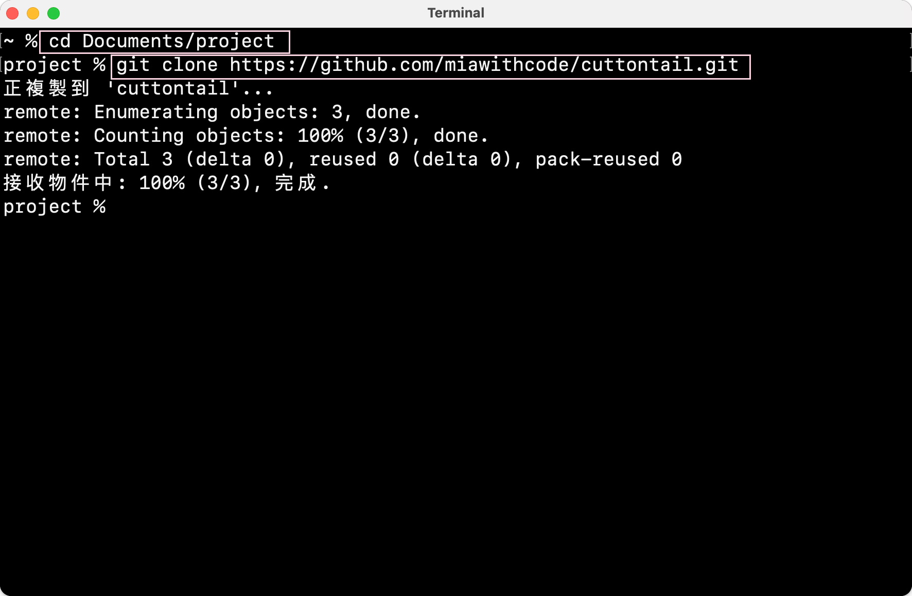

---

## 5. 使用Hugo创建网站

1. 进入刚刚克隆下来的**博客源仓库**文件夹（比如：我的博客源仓库文件夹名是 `cuttontail`，则`cd cuttontail` ），在这个文件夹里用Hugo创建一个网站文件夹。
2. 用Hugo创建网站文件夹的命令是 `hugo new site 网站名字`。(比如，我的命名是 `cuttontail-blog`)

    ```shell
	cd cuttontail
	hugo new site cuttontail-blog
    ```

    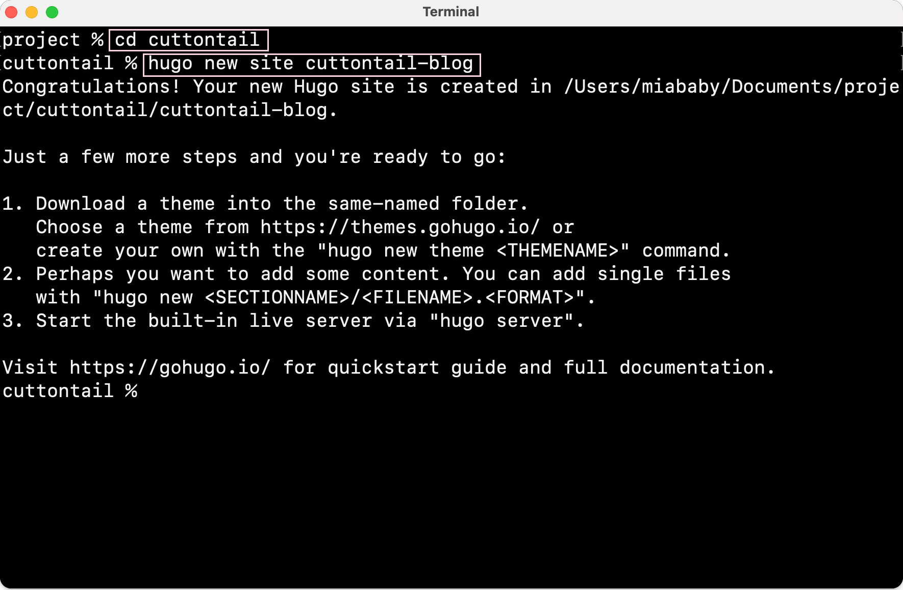
3. 用Hugo创建的网站共有7个文件夹和1个文件，这些文件分别代表：
    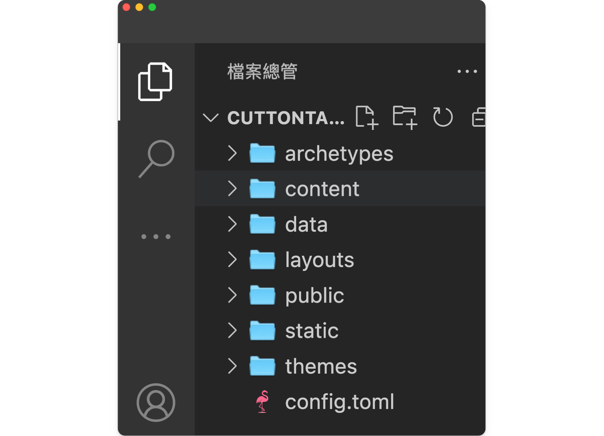

    - **archetypes**：存放用hugo命令新建的md文件应用的front matter模版
    - **content**：存放内容页面，如Blog
    - **layouts**：存放定义网站的样式，写在`layouts`文件下的样式会覆盖安装的主题中的 `layouts`文件同名的样式
    - **static**：存放所有静态文件，如图片
    - **data**：存放创建站点时Hugo使用的其他数据
    - **public**：存放Hugo生成的静态网页
    - **themes**：存放主题文件
    - **config.toml**：网站配置文件

---
## 6. 安装和配置Hugo主题

### 6.1 选择Hugo主题

可以从[Hugo社区提供的主题](https://themes.gohugo.io/)中选择一个喜欢的主题应用在自己的网站中。

### 6.2 安装Hugo主题

1.  一般在你选择的Hugo主题的文档中，都会给出「如何安装这个主题」的命令，比如我选用的 **Hugo Bear Blog** 的文档中给出：

    
2. 打开刚刚用Hugo创建的网站文件夹（我的是cuttontail-blog），在终端输入文档中给出的命令。
    
3. 这时可以看到在themes文件夹中，多出了刚刚安装的主题文件，代表主题安装成功。
    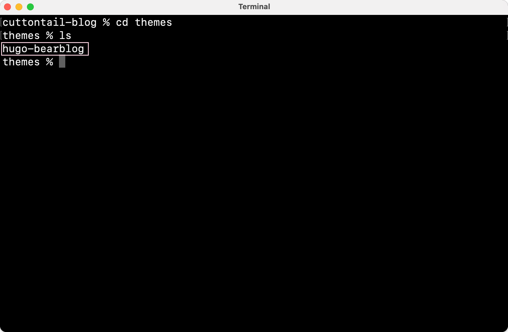

### 6.3 配置Hugo主题

1. 一般安装的Hugo主题的文件结构中都会有 `exampleSite` 文件夹，也是你在选择主题时参考的网站demo。
2. **把 `exampleSite` 的文件复制到站点目录，在此基础上进行基础配置**。
非常推荐这么做，这样做能解决很多「为什么明明跟教程一步一步做下来，显示的结果却不一样？」的疑惑。（这主要是因为不同的主题模版配置文件不同导致的。）
3. 在把`exampleSite`文件复制到站点目录时，根据**对应**文件夹进行复制文件
    - 比如`exampleSite`下有 `content` ,  `static` 和 `config.toml` 3个文件，就找到你自己的站点跟目录下这对应的三个文件。在把对应目录中的内容分别复制过去。
    
    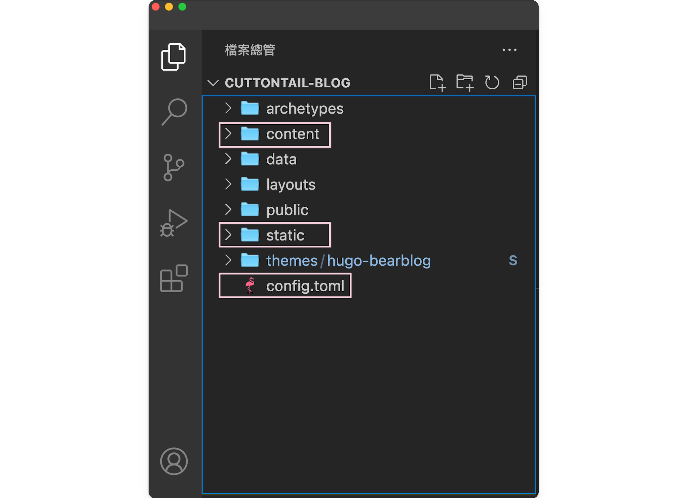

4. 其中在复制config.toml的内容时要注意：
    - **baseURL**
        ```shell
	    baseURL = "https://example.com/" #把https://example.com/改成自己的域名	        
        ```
        如果你没有在GitHub Pages中设置自定义域名，这里的域名应该填 `https://<username>.github.io/` （⚠️注意：最后的`/`不要忘了加）
    - **themes**
        ```shell
        themes = "你选择的主题名字"。 #这一行命令代表启用你安装的主题
        ```
        在 `config.toml` 中输入这行命令才能启用安装的主题，不过一般这行命令在你复制 `exampleSite` 的配置文件信息时，主题作者已经写好了这行。

---
## 7. 用Hugo创建文章

用Hugo创建一篇文章的命令是:
```shell
hugo new xxx.md
```
用这个命令创建的Markdown文件会套用 `archetypes` 文件夹中的front matter模版，在空白处用Markdown写入blog内容。
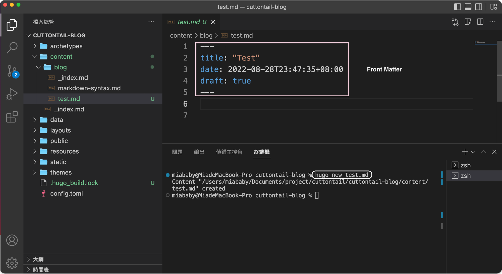

其中：`draft: true`代表这篇文章是一个草稿，Hugo不会显示草稿，要在主页显示添加的文章，可以设置 `draft: false`；或者直接删掉这行。

---
## 8. 本地调试和预览

1. 在发布到网站前可以在本地预览网站或内容的效果，运行命令：
    ```shell
	hugo server
    ```
    
2. 也可以在本地编辑Markdown文件时，通过 `hugo server` 来实时预览显示效果。
3. `hugo server` 运行成功后，可以在 `http://localhost:1313/` 中预览网站
    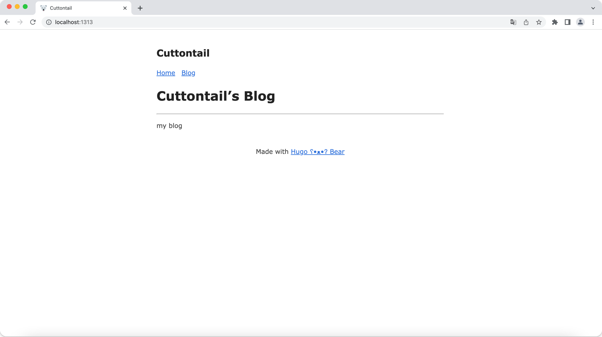

---
## 9. 发布内容

1. `hugo` 命令可以将你写的Markdown文件生成静态HTML网页，生成的HTML文件默认存放在 `public` 文件夹中。

    ```shell
	hugo
    ```
    
2. 因为`hugo` 生成的静态HTML网页文件默认存放在 `public` 文件中，所以推送网页内容只需要把 `public` 中的HTML网页文件发布到GitHub Pages仓库中。
3. 将 `public` 文件夹初始化为Git仓库，并设置默认主分支名为 `main`。这么做的原因是：
    - GitHub创建仓库时生成的默认主分支名是 `main` 
    - 用 `git init` 初始化Git仓库时创建的默认主分支名是 `master` 
    - 将 `git init` 创建的 `master` 修改成 `main` ，再推送给远端仓库 `<username>.github.io` ，这样才不会报错。

    ```shell
    cd public
	git init -b main
    ```

    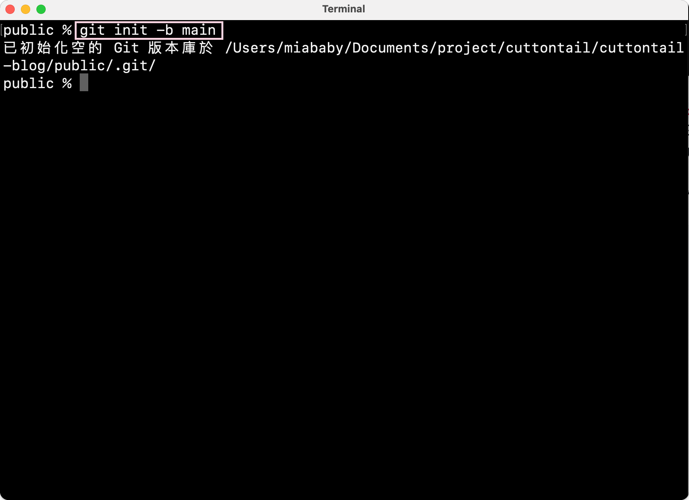
4. 将 `public` 文件夹关联远程GitHub Pages仓库，使用GitHub Pages仓库的SSH链接。
    - （ ⚠️ 注意：要让SSH链接起作用，需要你添加过SSH Key。如果你没有设置SSH Key，请参考[如何在Mac上为GitHub设置SSH Key](/blog/how-to-add-ssh-key-to-github-on-mac/)）
    
    - **GitHub Pages仓库的SSH链接可以在这里查看：**
    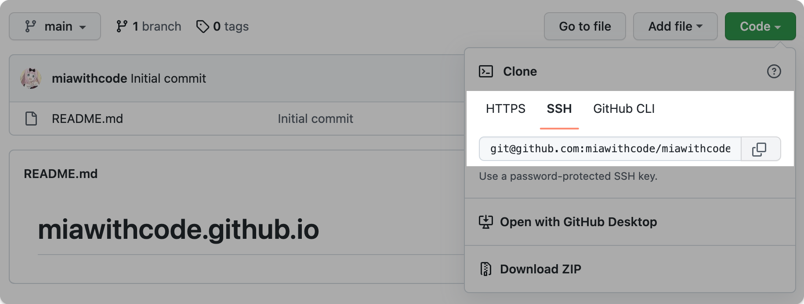
    
    ```shell
	git remote add origin git@github.com:miawithcode/miawithcode.github.io.git
    ```

    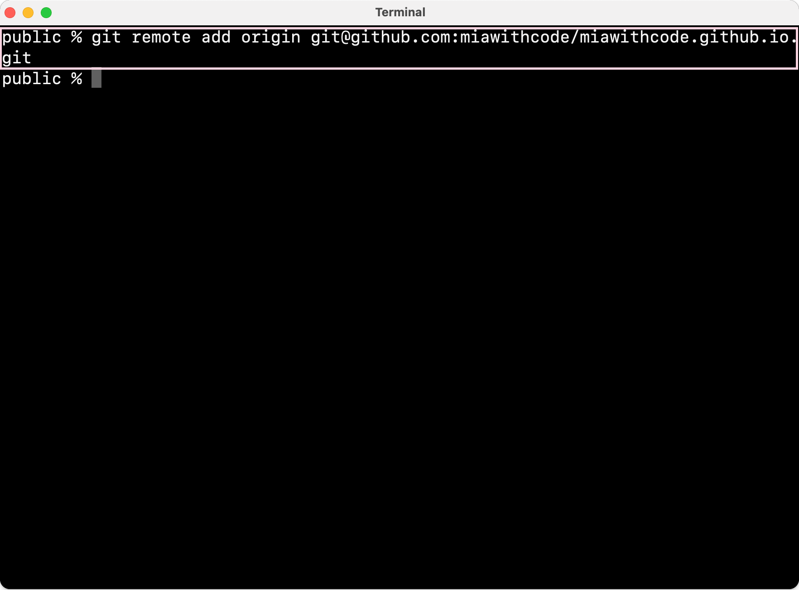

5. 推送**博客源仓库**的 `public` 文件夹中的HTML网页文件到**GitHub Pages仓库**中，在推送仓库内容前要先用 `git pull --rebase origin main` 和远端仓库同步，否则会报错。
    ```shell
	git pull --rebase origin main 
	git add .
	git commit -m "...(修改的信息)" 
	git push origin main
    ```
    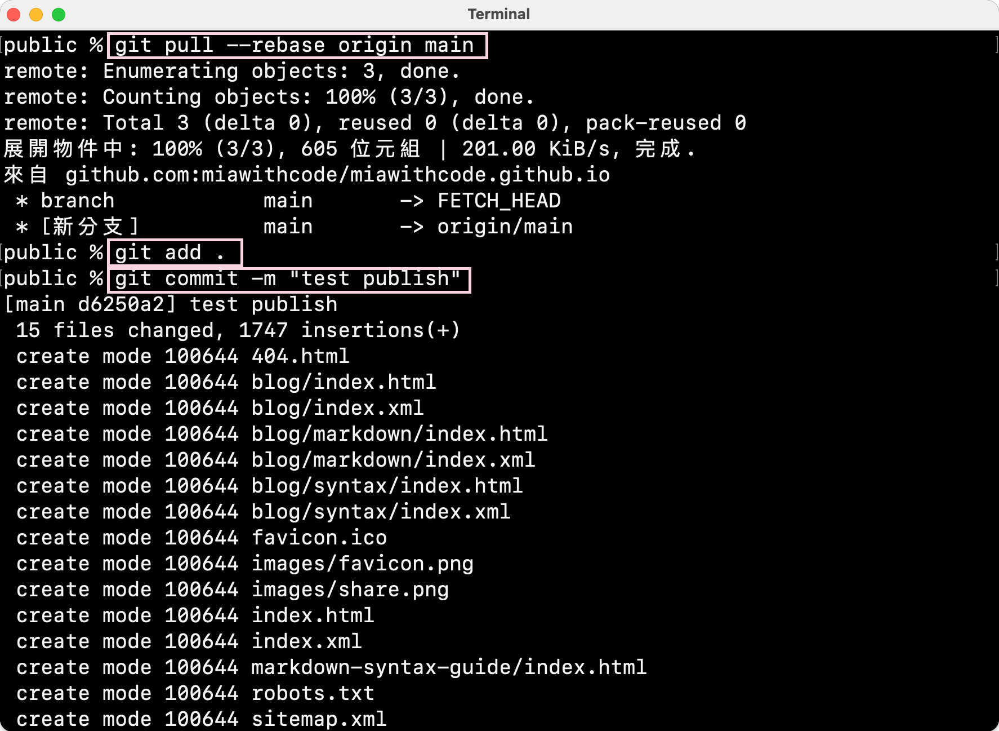
    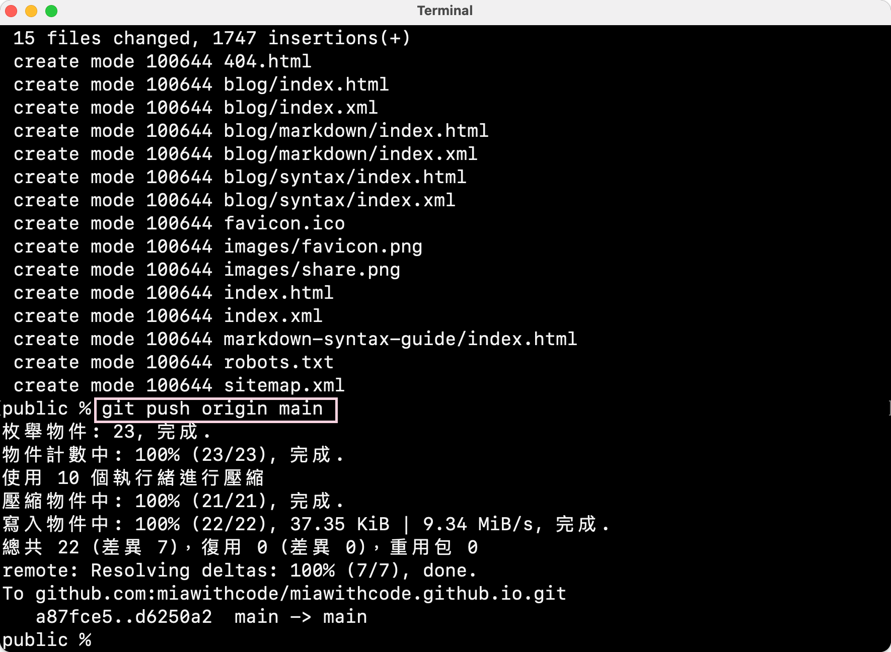
6. 转到GitHub中查看**GitHub Pages仓库**中是否存在刚刚推送的文件，存在则代表推送成功。
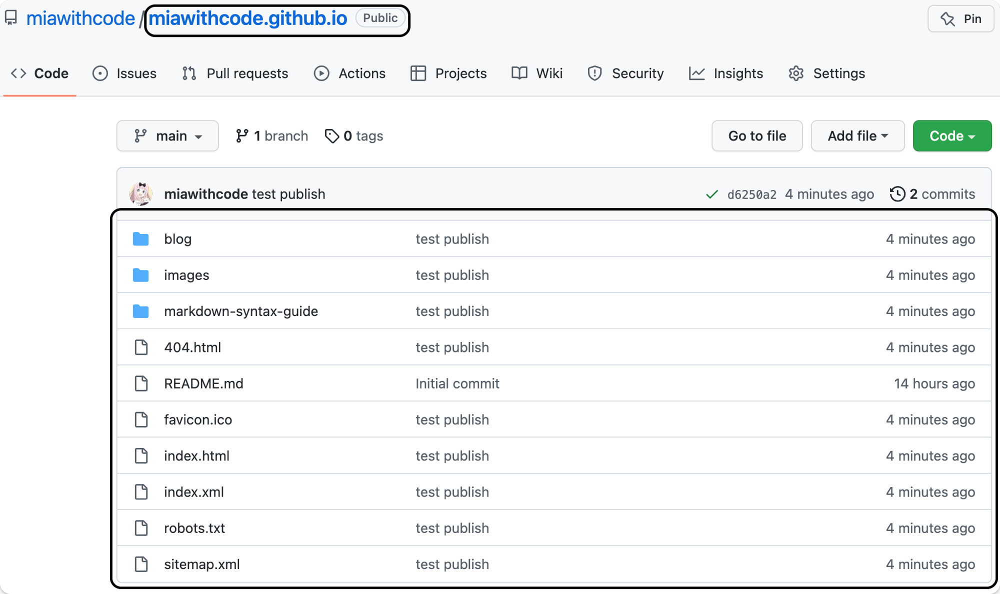

7. 如果你没有设置自定义域名，且把 `comfig.toml` 文件中的 `baseURL` 设置为 `https://<username>.github.io`，就可以在 [https://username.github.io]() 中查看刚刚创建的网站。
( 👀 我使用的是自定义域名，所以这里用我的自定义域名查看。)


8. 后续的更新步骤：
	1. 创建你的文章.md
	2. 用 `hugo server` 在本地预览，满意后准备发布。
	3. 运行 `hugo` 命令将Markdown文件生成HTML文件。
    4. 将修改先提交至**博客源仓库**
    ```shell
    git add .
    git commit -m "...(修改的信息)"
    git push
    ```
	5. 打开 `public` 文件
	6. 运行：
	```shell
	git add .
	git commit -m "...(修改的信息)" 
    git pull --rebase origin main #可选,如果远端仓库与本地一致，则不需要合并。
	git push origin main
    ```
    - 如果你使用的是自定义域名，第一次推送成功后，GitHub Pages 仓库会生成CNAME文件，所以第二次推送还要再合并一次：`git pull --rebase origin main`。后续的更新Blog就不再需要使用这个命令了。（根据实际情况使用）
9. 发布内容除了手动发布，还能使用GitHub Action自动发布。但我认为刚刚搭建好一个网站，立刻就用GitHub Action有些Overwhelming，先手动发布，熟练之后再开始使用GitHub Action自动发布会比较好。

---
## Reference

- [Creating a Blog with Hugo and Github in 10 minutes](https://youtu.be/LIFvgrRxdt4)
- [Hugo + GitHub Action，搭建你的博客自动发布系统](https://www.pseudoyu.com/en/2022/05/29/deploy_your_blog_using_hugo_and_github_action/)
- [Hugo - Quick Start](https://gohugo.io/getting-started/quick-start/)