SSH(Secure Shell) 是允许两台电脑之间通过安全连接进行数据交换的网络协议。

在本地电脑生成 SSH Key 私钥，再将 SSH Key 公钥添加到 GitHub，就实现了本地电脑和 GitHub 服务器安全连接，可以把本地仓库推送到 GitHub 远程仓库，或把 GitHub 远程仓库拉取到本地仓库，即两台电脑间的数据交换。

**Noted**：GitHub 在 2022 年 5 月添加了 SSH 安全性，以往添加 SSH Key 的教程在有些细节处可能不适用，这是 2022 年下半年添加 SSH Key 的教程。

## 1. 生成 SSH Key

1. 点开[GitHub](https://github.com/)账号头像下的 `Settings`
   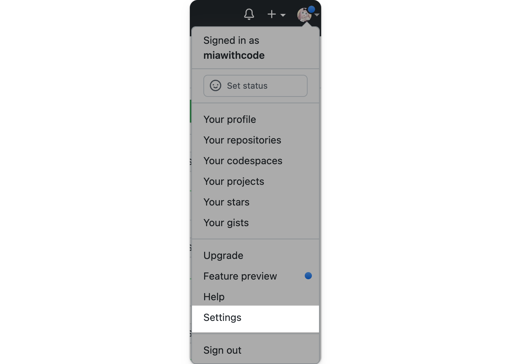

2. 找到 `Settings` 下的 `SSH and GPG keys`，点击 `generating SSH keys`，点击后会打开一个新的页面。
   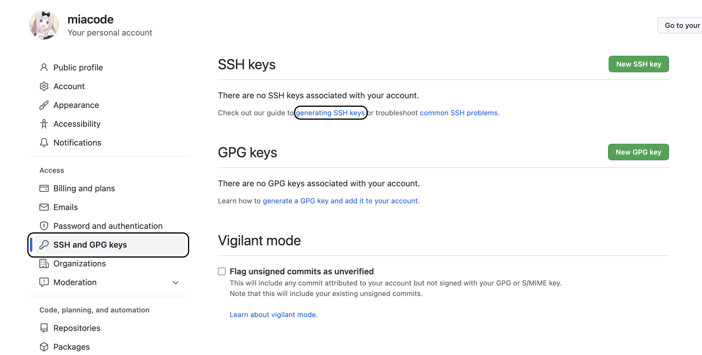

3. 在新的页面中选择 `Generating a new SSH key and adding it to the ssh-agent`
   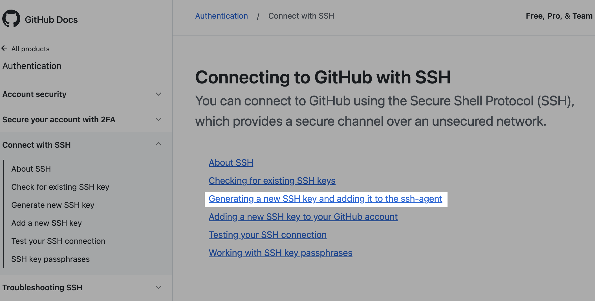

4. 注意选择对应操作系统的教程。
   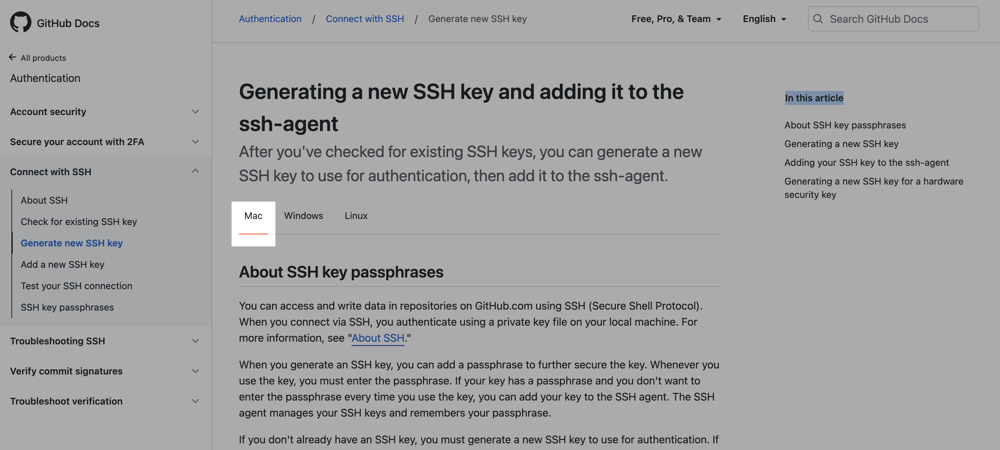

5. 往下滑动页面会看到 GitHub 给出的 Mac 下生成 SSH Key 的指南，按照指南的步骤一步一步进行。
   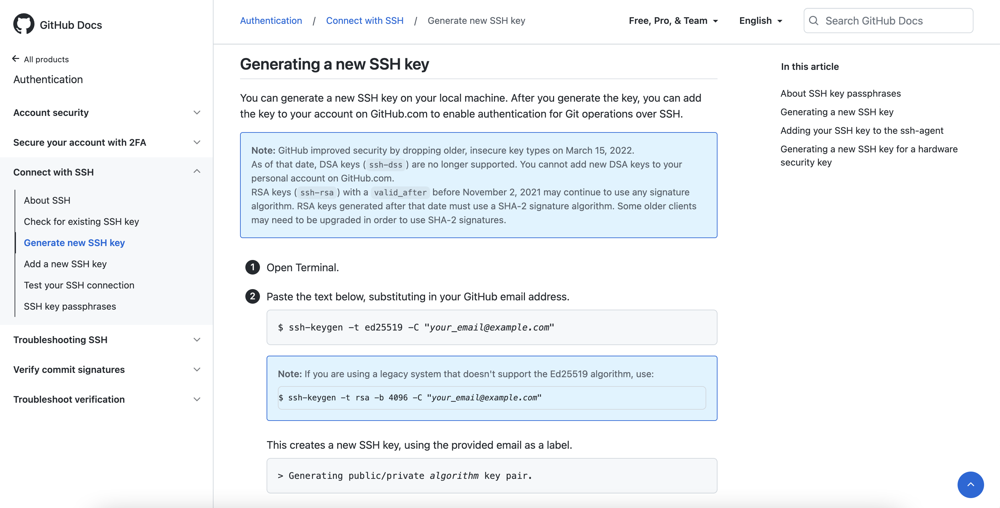

6. 打开终端（Terminal），复制粘贴以下文本到终端，把 `your_email@example.com` 替换成你注册 GitHub 时使用的邮箱，然后按下 Enter 键。
   ```shell
   ssh-keygen -t ed25519 -C "your_email@example.com"
   ```
   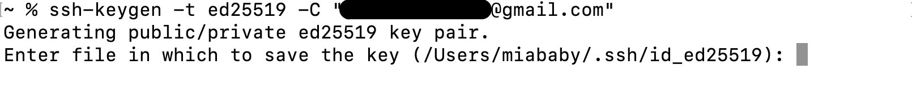

- 如果你不记得注册 GitHub 时使用的邮箱，可以从 `Settings` 中的 `Emails` 中查看。
  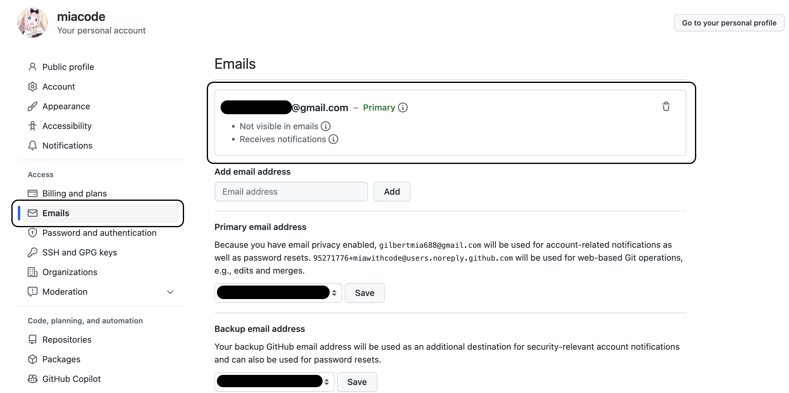

7. 出现 `Enter file in which to save the key(...)` ，按下 `Enter`键，一直按 `Enter` 直到出现以下画面。
   

8. 🎉 恭喜你的 SSH Key 已经生成成功，接下来把生成的 SSH Key 添加到 ssh-agent。

---

## 2. 添加 SSH Key 到 ssh-agent

1. 在终端（Terminal）中输入命令：
   ```shell
   eval "$(ssh-agent -s)"
   ```

- 命令执行后终端会给出**Agent pid**
  

2. 如果你使用的是[**macOS Siera 10.12.2 或以上的版本**](https://docs.github.com/cn/authentication/connecting-to-github-with-ssh/generating-a-new-ssh-key-and-adding-it-to-the-ssh-agent#adding-your-ssh-key-to-the-ssh-agent)，你需要修改 `~/.ssh/config` 文件来自动加载密钥到 ssh-agent 和储存 passphrases 到你的钥匙链。

   - 首先，检查电脑中是否存在 `~/.ssh/config` 文件

   ```shell
   open ~/.ssh/config
   ```

   - 如果像我一样显示这个 config 文件不存在，则创建这个文件
     

   ```shell
   touch ~/.ssh/config
   ```

   - 用编辑器打开 `~/.ssh/config` 文件

   ```shell
   nano ~/.ssh/config
   ```

   - 在 nano 窗口中复制粘贴以下代码：

   ```
   Host *
   	AddKeysToAgent yes
   	UseKeychain yes
   	IdentityFile ~/.ssh/id_ed25519
   ```

   - 粘贴代码后按 `control+X` 退出编辑器
     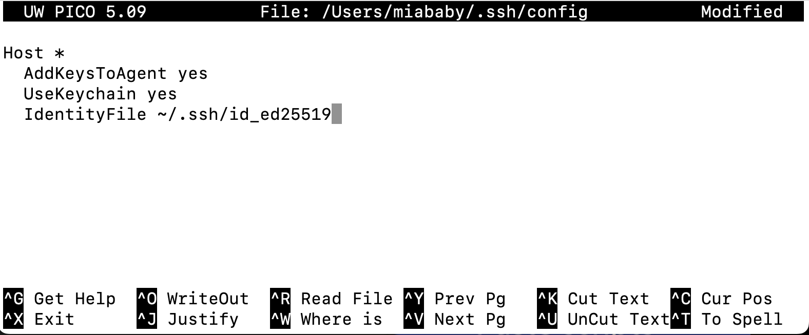

   - 输入 `y` 保存更改
     

   - 出现这个画面后再按 `Enter` 键  
      

3. 将 SSH Key 添加到 ssh-agent。如果你使用的是[**Mac Monterey(12.0)及以上版本**](https://docs.github.com/cn/authentication/connecting-to-github-with-ssh/generating-a-new-ssh-key-and-adding-it-to-the-ssh-agent#adding-your-ssh-key-to-the-ssh-agent)，请使用以下命令（~~因为在 Mac Monterey(12.0)及以上版本中，`-K` 标志已经被废弃，被 `--apple-use-keychain` 代替~~）。
   ```shell
   ssh-add --apple-use-keychain ~/.ssh/id_ed25519
   ```
   - 如果不是 Mac Monterey(12.0)及以上版本，使用以下命令：
   ```shell
   ssh-add -K ~/.ssh/id_ed25519
   ```

- 🎉 出现 `Identity added` 即表示添加成功。
  

---

## 3. 添加 SSH Key 到 GitHub

1. 在终端输入以下命令， `pbcopy` 会复制 SSH Key 内容到剪贴板
   ```shell
   pbcopy < ~/.ssh/id_ed25519.pub
   ```
2. 再次打开 GitHub `Settings` 下的 `SSH and GPG Key` ，点击 `New SSH key`
   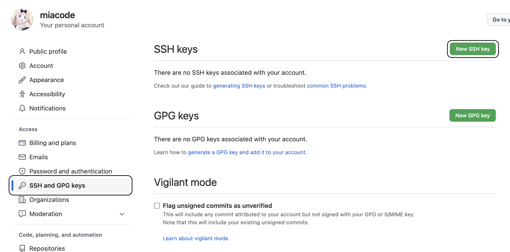
3. 添加本机生成的 SSH Key 到 GitHub：
   - 在**Title**中给这个 SSH Key 命名
   - **Key Type**选择 `Authentication Key`
   - 在**Key**中 `Command+V` 粘贴刚刚复制的 SSH Key
   - 添加后点击 `Add SSH Key` 。
     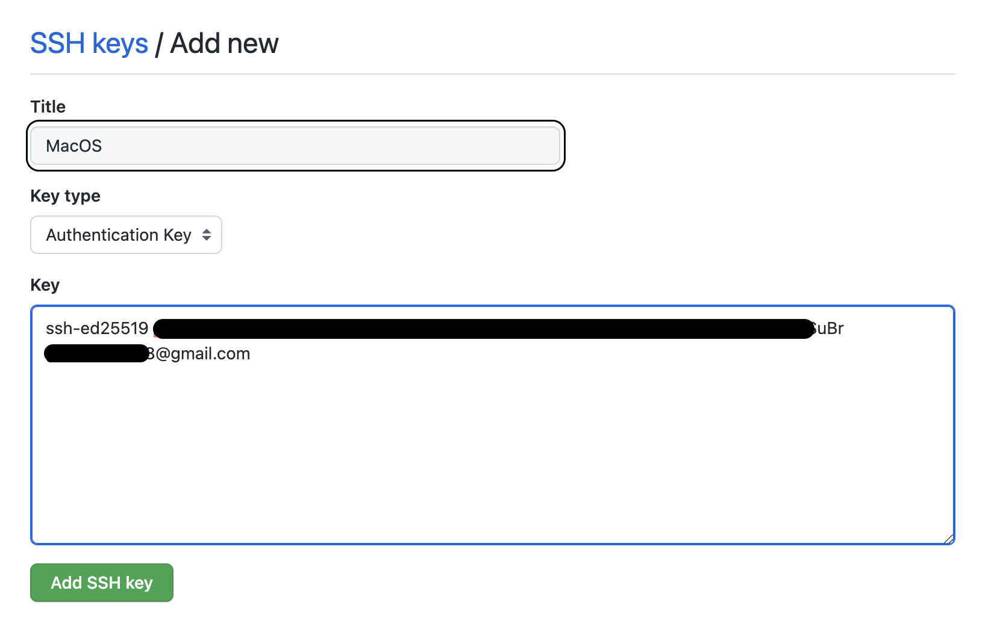
4. 🎉 添加完成。

---

## 4. 测试 SSH Key 是否添加成功

1. 选择一个要用 SSH Key clone 的仓库，复制这个仓库的 SSH 链接。
   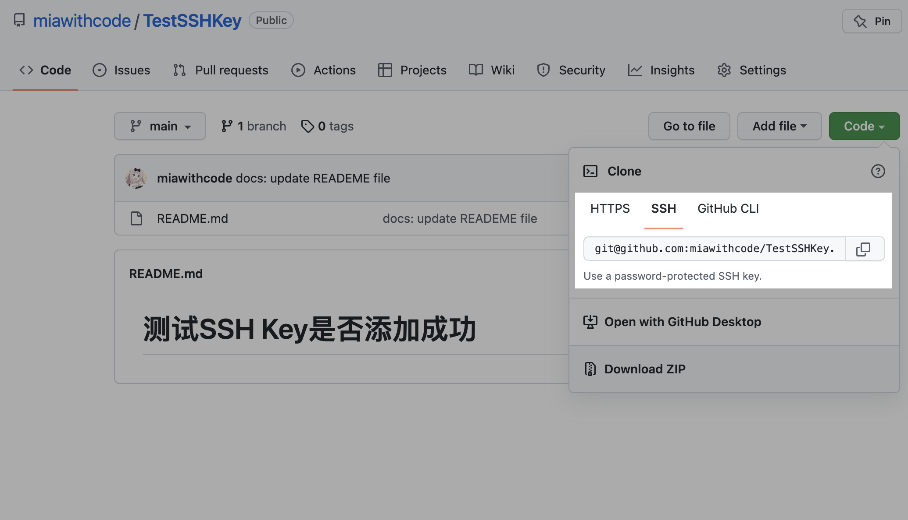
2. 在终端输入:
   ```shell
   git clone [ssh-url]
   ```
   
3. 🎉 clone 成功即代表 SSH Key 添加成功。

---

## Reference

- [How to Set Up an SSH Key to GitHub on Mac](https://www.youtube.com/watch?v=_RsP81Et12s)
