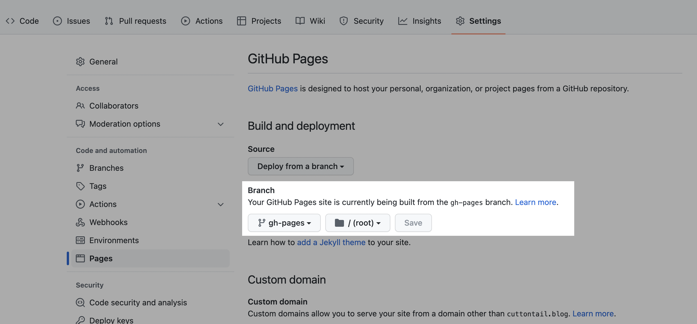

根据 [GitHub Pages 官网](https://pages.github.com/)介绍，一个GitHub账号只能拥有一个 GitHub Pages 网站，但该账号可以拥有无限的项目 GitHub Pages 网站。当仓库中已经有一个`<username>.github.io`时，要如何为项目创建 GitHub Pages？

答案是：**在项目仓库中建立gh-pages分支**。

## 1. 在本地创建空的 `gh-pages` 分支
以Hugo建站为例，Hugo生成的所有 `html` 文件会储存在 `public` 文件夹中，所以只需将 `public` 文件夹中的内容上传至 `gh-pages` 分支并部署。

```shell
# 进入要上传的文件夹
cd public
```

```shell
# 将文件夹初始化为 git 仓库，设置主分支为 main
git init -b main
```

```shell
#创建 gh-pages 分支，并切换到 gh-pages 分支
git checkout --orphan gh-pages
```

## 2. 推送 `public` 文件中的内容至 `gh-pages`

```shell
#将文件提交到暂存区并提交 git 修改信息
git add .
git commit -m "...（信息）"
```

```shell
#连接远程仓库(仓库的 SSH 链接)
git remote add origin git@github.com:username/repository.git
```

```shell
#将 `public` 文件夹中的内容推送至远程仓库
git push origin gh-pages
```

## 3. 部署项目至 `gh-pages` 分支


做完这一步就大功告成了，如果你没有为项目设置自定义域名，接下来可以在 `https://<username>/repository.github.io` 看到刚刚部署的项目内容。

---
## Reference
- [GitHub Pages 官网](https://pages.github.com/)
- [在github上建立gh-pages分支](https://www.jianshu.com/p/2352c5a6f229)

## Related Posts
- [如何用 GitHub Pages + Hugo 搭建个人博客](/blog/create-a-wesite-using-github-pages-and-hugo/)