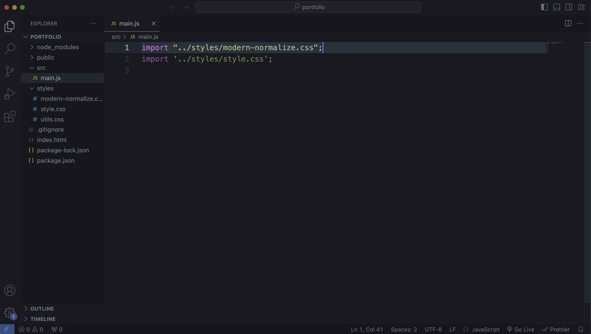
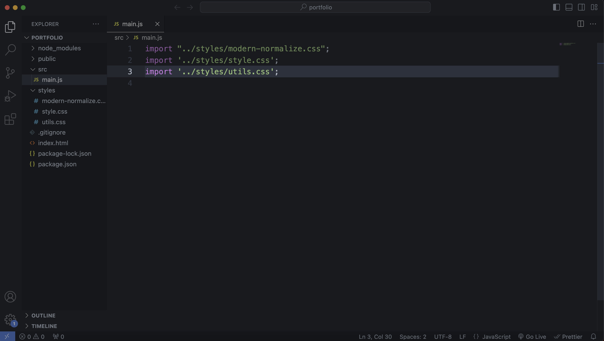

## 1. 前言

在开始做这个项目前，我通过文档复习了一遍 HTML 和 CSS，我的 JavaSciript 基础薄弱，虽然跟着教程把代码敲下来了，但其中使用到的很多语句，我都需要搜索资源学习一遍，虽然遇到了阻碍，但还是通过这个项目学到了很多。

我在这个项目中最大的收获是接触媒体查询在实际项目中最佳的应用，也了解了一个不用任何前端框架的网站该有的文件结构。对于一个刚学过前端基础，不会任何框架，还没有真正实操过的新手来说，这个练习的帮助非常大。所以决定写一篇博客记录我到底学到了什么。

创建这个网站的过程中使用到的基本工具有 [Node.js](https://nodejs.org/en)、 [Git](https://git-scm.com/)、 [Vite](https://vitejs.dev/)。其实就是需要安装这些工具，再使用一些它们提供的简单的命令。

这里是[网站 Demo](https://mia-portfolio-website-practice.vercel.app/)，[源代码](https://github.com/miawithcode/building-portfolio-website) 和[原视频教程](https://youtu.be/dLDn_k8GmaU?si=qF_sc1m7io16S7cS)。

---

## 2. 工具资源

我还从这个项目中获悉了一些没用过的资源，这里也做一下记录。

### 2.1 选择字体

以前需要字体资源时我只知道 [Google Font](https://fonts.google.com/)，通过教程我了解到另一个字体资源：[Font Share](https://www.fontshare.com/)。


Font Share 的使用方法和 Google Fonts 类似：在 HTML 的头部导入字体链接，在 CSS 文件中通过字体名直接使用。

### 2.2 选择颜色

自己搭配颜色是一件很困难的事情，通过这个教程我才知道原来可以直接从[Tailwind 文档](https://tailwindcss.com/docs/customizing-colors) 中提供的颜色中进行颜色搭配。像 Tailwind 这样的前端框架提供的颜色有特殊的设计模式，且有系统地创建的，从中挑选颜色是一个明智的选择。


当想要找到某一颜色的更深或更浅色时，可以在[W3 School 的 Color Converter](https://www.w3schools.com/colors/colors_converter.asp) 中粘贴该颜色的值，然后点击【**Use this color in our Color Picker**】，就会看到同一色调由浅到深的 HEX 值，和颜色深浅的百分比，我们还能看到刚刚粘贴的颜色处在的位置。


### 2.2 选择 icon

和字体资源相同，有关 icon 资源以前我只知道[Font Awsome](https://fontawesome.com/)，通过这个教程我了解到另一个 icon 资源[Heroicons](https://heroicons.com/)。


使用 Font Awsome 的步骤要更复杂，但使用 Heroicons 的话，只需要点击 icon 上的【**Copy SVG**】，复制到想用的地方，就可以直接使用了。

复制 svg 代码之后有几件事要注意：

1. 在 HTML 中复制 svg 后，需要删除 svg 中自带的`class`。
2. 在设定了 svg 的 `width` 和 `height` 之后，才能看到图标。

---

## 3. 使用 Vite 创建项目

刚开始学习前端时，我们通常会在某个文件夹下直接创建`index.html`、`style.css`和`script.js`。但在真正的项目中，一般不会这样从零开始，而是会使用前端构建工具为我们自动生成一些文件和代码，[Vite](https://vitejs.dev/) 就是这样一个前端构建工具。

### 3.1 创建项目

1. 点开[Vite 首页](https://vitejs.dev/)，找到菜单栏的【**Guide**】，在【**Getting Started**】的文章中下滑直到找到标题【**Scaffolding Your First Vite Project**】，找到【**npm**】命令并复制：

   ```bash
   npm create vite@latest
   ```

2. 打开终端，进入想要存放项目的文件夹（假设我们想要把项目文件夹放在桌面），输入刚刚复制的命令并回车。

   ```bash
   cd Desktop
   npm create vite@latest
   ```

3. 运行刚刚输入的命令后，Vite 会提示输【**Project Name**】，这会创建一个以【**Project Name**】命名的项目文件夹。
   
4. 命名后 Vite 会提示我们选择【**Framework**】，因为我们在这个项目中没有用到任何框架，这里选择`Vanilla`并回车。
   
5. Vite 提示选择【**JavaScript**】还是【**TypeScript**】，这里选择`JavaScript`。
   
6. 提示【Done】代表项目创建成功。
   

7. 接下来在终端进入进刚刚创建的项目文件夹（我的项目文件夹名字是 portfolio）。
   ```bash
   cd portfolio
   ```
8. 在项目文件夹中安装指定的包和它们的依赖项，并将它们保存在项目的`node_modules`文件夹中。
   ```bash
   npm i
   ```
   
9. 测试项目运行是否正常，输入下行代码。如果没有任何报错，则可以用`control + c`结束运行。
   ```bash
   npm run dev
   ```
   

### 3.2 修改部分文件和文件结构

用 VS Code 打开项目文件夹，我们能看到 Vite 自动创建的文件中有`index.html`，`style.css`和`main.js`。我们需要在此基础上做一些简单的修改。


1. 修改文件
   - 打开`style.css`，删除里面的所有代码
   - 打开`main.js`，删除除了第一行`import './style.css'`之外的所有代码。
   - 打开`index.html`删除这行：
     ```html
     <div id="app"></div>
     ```
2. 删除不需要的文件
   - 删除`counter.js`文件
   - 删除`javajavascript.svg`文件
3. 创建文件夹

   - 创建`styles`文件夹，把`style.css`移动到该文件夹下。并在`main.js`中修改文件路径：

     ```javascript
     /* 将 import './style.css' 修改为 import '../styles/style.css' */

     import "../styles/style.css";
     ```

   - 创建`src`文件夹，把`main.js`移动到该文件夹中，并在`index.html`中修改文件路径：

     ```html
     <!-- 将<script>标签中原来src属性中的“main.js”修改为“./src/main.js” -->

     <script type="module" src="./src/main.js></script>
     ```

修改完成后的文件结构如下：


### 3.3 预览网页

在 VS Code 中打开终端，输入下行命令即可开始预览网页。

```bash
npm run dev
```

以前我预览网页时总是使用插件[Live Server](https://marketplace.visualstudio.com/items?itemName=ritwickdey.LiveServer)，但是现在发现原来实际项目中不用 Live Server。

---

## 4. HTML 结构与 CSS 命名

### 4.1 HTML 结构

我们把网页的结构分为主要 3 个部分：**header**、**main**、和 **footer**。其中，把网页中除了 header 和 footer 的所有内容部分都放进 main 中，因为网页的内容分为多个部分，我们用`<section>`来代表网页的各个部分。

在开始开发前，先想好网页一共有多少部分，有多少部分就创建多少个`<section>`标签。并且一个一个 `<section>` 进行开发，尚未开发到的`<section>`可以先注释掉。

以前我只会`<div>`来代表某个网页的一部分，现在我学会了用更有语义化的标签`<section>`来开发网页。

```html
<header>
  <nav></nav>
</header>
<main>
  <section></section>
  <!-- <section></section> -->
  <!-- <section></section> -->
  <!-- <section></section> -->
</main>
<footer></footer>
```

### 4.2 BEM 命名法

BEM(Block Element Modifier)是对 CSS 命名的一种规范，有助于编写更干净的 CSS。这个项目是我第一次接触 BEM 。BEM 的使用方式是：`B__E--M`，其中：

- Block 代表包含所有元素的组件
- Element 代表组件中特定部分的元素。
- Modifier 代表像特定元素添加样式的修饰符

这样看太抽象了，直接看项目中的一个例子：

```html
<section class="about">
  <div class="about__content">
    <h2 class="about__title">About</h2>
    <p class="about__description">...</p>
    <h3 class="about__subtitle">...</h3>
  </div>
  <div class="about__img-wrapper">
    
  </div>
</section>
```

- 可以看到在`<section>`中我们就指明了这个组件是一个`about`组件，包含在`<section></section>`中的所有内容都是一个 About 页面中的内容。
- 组件中的元素命名都以组件名开头，加上两个下底线`__`后，再加上元素的名字，如`about__title`、`about__description`。
- 关于 Modifier ，查资料说 Modifier 前面应该是两个连字符`--`，但项目中用的是一个连字符`-`，比如`about__img-wrapper`、`feature__img-container`。

将 HTML 元素用描述性的语言命名，通过 BEM 命名法也能清晰地看到这个元素是属于哪一个组件的，有助于编写和维护。

## 5. 导入文件

### 5.1 导入 CSS 文件

假设一个页面有 header、hero、about、project、contact、footer 6 个组件，在 styles 文件夹中，创建一个 components 文件夹，添加以每个部分的名字命名的 css，如`header.css`、`about.css`、`contact.css`等。

根据开发的进程，逐步添加每部分的`.css`文件，并导入`main.js`中，导入的组件 CSS 文件要确保在`style.css`之下，在`.utils.css`之上，如：

```javascript
import "../styles/style.css";
import "../styles/components/header.css";
import "../styles/components/about.css";
import "../styles/utils.css";
```

### 5.2 导入 JavaScript 文件

假设需要 JavaScript 文件`mobile-nav.js`：

1. 首先把所有 JavaScript 代码写在一个箭头函数下，并通过`export`导出。
    ```javascript
    const mobileNav = () => {
    /* ... */
    };

    export default mobileNav;
    ```

2. 在`main.js`中导入`mobile-nav.js`，并调用该箭头函数。
    ```javascript
    import mobileNav from './utils/mobile-nav';

    mobileNav();
    ```

---

## 6. 添加基本样式

在正式开发页面前，先添加一些基本的样式，主要是做一些**重置样式**、**定义颜色变量和 Size 变量**、**创建可复用实用类**（如按钮、容器、间距）之类的准备工作。

### 6.1 添加 modern normalize

[modern normalize](https://github.com/sindresorhus/modern-normalize) 是一个清楚浏览器默认样式的样式表。因为不同的浏览器对各种 HTML 元素都有默认样式，一个浏览器中的默认样式在下一个浏览器中可能会有所不同，所以我们使用 modern nomalize 来重置这些样式，让 HTML 元素在所有浏览器中的显示一致。

1. 虽然 modern normarlize 的`README.md`中写了关于安装的命令，但是我们选择在代码中直接找到 `modern-normalize.css`。

2. 打开`modern-normalize.css`后点击【**Raw**】

3. `command + A`全选所有代码并复制。

4. 回到 VS Code 中，在`styles`文件下创建文件`modern-normalize.css`，并粘贴刚刚复制的代码。


5. 在`main.js`中的第一行导入`modern-normalize.css`，因为我们希望`modern-normalize.css`在项目中的优先级是**最低**的。
```javascript
import "../styles/modern-normalize.css";
```



### 6.2 重置元素样式

通常来说，重置元素样式的第一件事会给全局选择器添加`box-sizing: border-box`。但由于`modern-normalize.css`已经包括这段代码了，所以我们**并不需要再写一遍**。

```css
/* style.css */
*,
::before,
::after {
  box-sizing: border-box;
}
```

以下是需要使用的重置代码块：

```css
/* style.css */
* {
  margin: 0; /* 将所有元素的外边距设置为0 */
  line-height: calc(
    1em + 0.5rem
  ); /* line-height设置成1.5是很常见的，但如果字体太大，行间距也会看起来太大，所以这里使用 calc 函数计算行高相对于字体大小的相对值，即1个字体大小的值加上0.5倍 root 元素大小的值，也就是8px */
}

html {
  scroll-behavior: smooth; /* 跳转到同一页面的不同部分时，添加平滑的过渡（transition）*/
}

body {
  font-family: "General Sans", sans-serif; /* 定义字体样式 */
}

img,
picture,
video,
canvas,
svg {
  display: block; /* 这些元素 display 的默认值是inline ，但其实在实际的网页中，很少看到它们是显示在行内的 */
  max-width: 100%; /* 让图片在必要时缩小，但绝不放大到大于其原始尺寸 */
  user-select: none; /* 不让用户选中这些元素 */
}

button {
  display: inline-block; /* 让 button 显示为 inline-block */
  padding: 0; /* 设置 button 的内边距为0 */
  border: none; /* 将 button 的边框设置为无 */
  background: none; /* 设置 button 的背景为无 */
  cursor: pointer; /* 设置悬停在 button 上的鼠标为手指符号 */
  color: inherit; /* 让 button 文本的颜色继承父元素的颜色 */
}
```

### 6.3 定义颜色变量

我们将项目中要使用的颜色设置成全局变量，这需要我们在开始开发网页前就想好要应用的颜色，提高开发效率。下列颜色只是一个示例参考，创建自己的项目时要根据实际情况修改。

```css
/* style.css */
:root {
  --clr-dark: #070a13; /* 因为教程认为 Tailwind 中最深的颜色 Slate 900 （11%）不够深，所以在 Color Converter 中找到了5%的更深色，但写这篇博客时， Tailwind 已经有了 Slate 950 更深色。但是这个思路依然可以参考。 */
  --clr-light: #f1f5f9; /* light 颜色用的是 Slate 100，夜间模式下主标题的颜色 */
  --clr-slate400: #94a3b8; /* 夜间模式下的副标题文本颜色 */
  --clr-slate600: #475569; /* 链接文本、段落文本的颜色 */
  --clr-slate800: #1e293b; /* 分割线的颜色 */
  --clr-rose: #e11d48; /* 链接色、按钮色等，rose 颜色用的是 Rose 600 */
  --clr-indigo: #4f46e5; /* 文本强调色， ingigo 颜色用的是 Indigo 600*/

  /* rose rgb(225, 29, 72) */
  /* indigo rgb(79, 70, 229) */
}
```

创建好颜色变量后继续重置样式，这次重置样式的主要和颜色相关，由于不同的项目使用的颜色不同，这是一个可以参考的思路，但之前的样式重置的内容是可以通用的。

```css
/* style.css */
a {
  color: var(--clr-rose);
}

strong {
  color: var(--clr-indigo);
}
```

### 6.4 定义 Size 变量

不同 Size 的值参考的也是[Tailwind 设计的值](https://tailwindcss.com/docs/font-size) 。

```css
/* style.css */
:root {
  /* sizes */
  --size-xxs: 0.5rem;
  --size-xs: 0.75rem; /* 在小于475px（xs）的屏幕上，应用于链接文本，移动端导航栏按钮 */
  --size-sm: 0.875rem; /* 在小于475px（xs）的屏幕上，应用于段落文本、按钮 */
  --size-base: 1rem; /* 在小于475px（xs）的屏幕上，应用于 icon  */
  --size-lg: 1.125rem;
  --size-xl: 1.25rem;
  --size-2xl: 1.5rem; /* 在小于475px（xs）的屏幕上，应用于大标题、移动端导航菜单列表图标*/
  --size-3xl: 1.875rem;
  --size-4xl: 2.25rem;
  --size-5xl: 3rem;
  --size-6xl: 3.75rem;
  --size-7xl: 4.5rem;
  --size-8xl: 6rem;
  --size-9xl: 8rem;
  --size-10xl: 10rem;
}
```

### 6.5 创建可复用的实用类（utility class）

我们在`utils.css`的文件中定义可复用的实用类。

1. 在`style`文件夹下创建`utils.css`。
2. 在`main.js`中导入了`utils.css`。要注意未来导入其他 CSS 文件时，需要确保`utils.css`永远是最后一个导入的 CSS 文件，因为它的优先级应该是最高的，否则里面的样式不会生效。
    ```javascript
    import '../styles/utils.css';
    ```
    
3. 我们在`utils.css`中定义那些样式相同并经常使用的元素，如按钮、容器、Section。

   - 首先添加按钮的样式。

     ```css
     /* utils.css */
     .btn {
       display: inline-block;
       font-weight: 600;
       text-decoration: none;
       letter-spacing: -0.05em; /* 让字母与字母之间更紧凑 */
       background-color: var(--clr-rose); /* 定义按钮的背景颜色 */
       color: var(--clr-light); /* 定义按钮文本的颜色 */
       padding: 0.5em 1em; /* 定义按钮的上下内边距是按钮字体大小的0.5倍，左右边距是按钮字体大小的1倍 */
       border-radius: 6px;
       /* box-shadow: ; */
       transition: all 0.3s;
     }

     .btn:hover {
       /* 鼠标悬停在鼠标上的样式 */
     }
     ```

   - 然后添加容器（Container）的样式。容器的响应式设计见[下一节：响应式设计](/blog/what-i-learned-after-developing-a-portfolio-website/#71-%e5%93%8d%e5%ba%94%e5%bc%8f%e5%b1%8f%e5%b9%95%e6%96%ad%e7%82%b9breakpoint) 。容器关于响应式设计的媒体查询代码也应该放在`utils.css`里。

     虽然我们还没有开始进行响应式设计，但有一件事需要提前了解：我们在进行响应式设计时应用的是「移动端优先」设计策略，媒体查询中的第一个查询条件是`@media (min-width: 475px)`，所以在媒体查询外的所有样式表示的是**在屏幕尺寸小于 475px 的设备上显示的样式**。

     ```css
     /* utils.css */

     .container {
       width: 100%; /* 一般来说，不推荐在容器（container）上使用百分比来设置大小，但在屏幕尺寸小于475px的设备上，没有什么其他选择 */
       margin-left: auto; /* 的确可以用简写margin: 0 auto，但由于utils.css有最高的优先级，如果在这里设置容器（container）的上下外边距为0，那我们将不再能为有类名为container的元素添加上下外边距 */
       margin-right: auto; /* 将左右外边距设置为auto使容器元素居中 */
       padding-left: 0.5rem; /* 将容器的左内边距设置为根元素的0.5倍 */
       padding-right: 0.5rem; /* 将容器的右内边距设置为根元素的0.5倍 */
     }
     ```

   - 添加 Section 的样式，一个网页分为多部分内容，每部分网页内容之间会有一些间距。

     ```css
     .section {
       margin-top: 5rem; /* 顶部外边距为根元素大小的5倍 */
     }

     /* 我们希望在大于1024px的屏幕上，网页每个部分的间距有所增加 */
     @media (min-width: 1024px) {
       .section {
         margin-top: 10rem;
       }
     }
     ```

---

## 7. 响应式设计

我们在这个项目中使用的是移动端优先（Mobile First）的响应式设计方式。先设计好移动端的用户界面，再随着屏幕宽度的扩大不断的放大元素，修改布局。移动端优先是标准的响应式设计方式。

### 7.1 屏幕断点（Breakpoint）

当`max-width`的大小和`min-width`设置的断点相同时，容器元素会在浏览器窗口碰到它的那一瞬间往里收缩。

```css
/* xs  */
@media (min-width: 475px) {
  .container {
    max-width: 475px;
  }
}

/* sm  */
@media (min-width: 640px) {
  .container {
    max-width: 640px;
  }
}

/* md  */
@media (min-width: 768px) {
  .container {
    max-width: 768px;
  }
}

/* lg  */
@media (min-width: 1024px) {
  .container {
    max-width: 1024px;
  }
}

/* xl  */
@media (min-width: 1280px) {
  .container {
    max-width: 1280px;
  }
}

/* 2xl  */
@media (min-width: 1536px) {
  .container {
    max-width: 1536px;
  }
}
```

### 7.2 从一列布局响应到两列布局(文本 + 图片)

假设有 2 个容器，一个是内容元素，包括标题，段落和按钮等，另一个是图片容器，包含一张图片。在移动端，它们默认垂直显示，只有一列布局。

1. 首先在 HTML 中写好两个`<div>`。

   ```html
   <!-- html -->

   <section class="about">
     <div class="about__content"></div>
     <div class="about__img"></div>
   </section>
   ```

2. 设置容器的`display: flex`，并将属性`flex-direction`设置为`column`，这样保证两个内容容器在移动端是一列垂直布局呈现的。

   ```css
   /* css */

   .about {
     display: flex;
     flex-direction: column;
     gap: 1rem;
   }
   ```

3. 在屏幕宽度大于 1024px 时，开始显示两列布局。

   ```css
   /* css */

   @media (min-width: 1024px) {
     .about {
       flex-direction: row; /* 将 column 改成 row ，换成两行布局 */
       justify-content: space-between;
       align-items: center;
     }
   }
   ```

这个响应式设计其实很简单，在移动端时，容器的`flex-direction: column`；在桌面端时，容器的`flex-direction: row`。

### 7.3 从一列布局响应到两列布局(图片 + 图片)

假设现在共有 6 张图片需要显示，在移动端我们理所当然地用一列垂直布局，在桌面端，我希望图片呈现 2x3 的两列布局。这样的情况下用 Grid 来布局比较合适。

1. 首先在 HTML 中写好 6 个图片标签，并将它们放在一个`<div>`里，这里为了更直观的说明，省去图片中的属性`src`和`alt`的具体内容。

   ```html
   <!-- html -->

   <div class="img-container">
     
     
     
     
     
     
   </div>
   ```

2. 在 CSS 中定义图片容器的`display: grid`。重点在于设置`grid-template-column`时，使用`autofit`关键字和`minmax()`函数。
   - `autofit`代表不再重复固定的值，只要空间足够，能重复几次就重复几次。
   - `minmax()`函数取 2 个值，一个是 min 值，代表我们希望设置图片宽度的最小值是多少。第二个是 max 值，代表我们希望设置图片宽度的最大值是多少。
   ```css
   .img-container {
     display: grid;
     grid-template-column: repeat(autofit, minmax(300px, 1fr));
     grid-gap: 1rem;
   }
   ```
3. 上个步骤中的代码让我们在屏幕宽度足够容纳 2x300px 时，图片能自动变成两列布局。但问题是当屏幕放大到足够容纳 4x300px 时，图片还可以变成四列布局。但我们希望图片一直是两列布局，解决办法很简单，只需要在屏幕放大到某一尺寸时，增加图片宽度的最小值，让屏幕最大也只能容纳两个图片的宽度就行了。

   ```css
   /* sm */
   @media (min-width: 640px) {
     grid-template-column: repeat(autofit, minmax(500px, 1fr));
     grid-gap: 1rem;
   }
   ```

### 7.4 三列响应式布局

当屏幕空间足够大时，显示三列布局；当屏幕空间只够两列的宽度时，就只显两列；如果屏幕空间不够两列的宽度了，则只显示一列。

1. 首先在 HTML 中写好三个`<div>`。

   ```html
   <!-- html -->
   <div class="container">
     <div></div>
     <div></div>
     <div></div>
   </div>
   ```

2. 在 CSS 中设置容器的`display: flex`，重点是`flex-wrap: wrap`。选中容器下的所有`<div>`，设置它们的最小宽度是`250px`，以及`flex: 1`，这样`<div>`最少也需要占据 250px 的宽度，如果浏览器宽度不够 2 个<`div`>的宽度，第一个`<div>`会自动拉长，直到容器可以容纳 2 个最小宽度的`<div>`，2 个<`div`>一起继续拉长，直到容器可以容纳 3 个最小宽度的`<div>`，从而实现我们想要的效果。

   ```css
   /* css */

   .container {
     display: flex;
     flex-wrap: wrap;
     gap: 1rem;
   }

   .container div {
     flex: 1;
     min-width: 250px;
   }
   ```

### 7.5 响应式字体和 Gap

由于我们在媒体查询外设计的样式都是当屏幕小于 475p 的默认样式，那么什么屏幕尺寸下我们需要增加字体大小和元素与元素之间的间隙 Gap 呢？

假设一个段落文本在小于 475px 的屏幕上设置的`font-size`是`--size-sm`。那么：

- 第一次增加字体大小在`min-width: 475px`（xs）的屏幕上，增加一个变量的大小，即`--size-base`。
- 第二次增加字体大小在`min-width: 1024px`（lg）的屏幕上，继续增加一个变量的大小，即`--size-lg`。
- 第三次增加字体大小在`min-width: 1280px`（xl）的屏幕上，继续增加一个变量的大小，即`--size-xl`。

标题（title）、副标题（subtitle）、按钮也是在同样的 3 个媒体查询中才有变化。

那么什么时候增加 Gap 呢？每次增加多少？

假设某元素的 Gap 在小于 475px 的屏幕上是`1rem`。那么：

- 第一次增加 Gap 在`min-width: 475px`（xs）的屏幕上，从`1rem`增加至`1.5rem`。
- 第二次增加 Gap 在`min-width: 1280px`（xl）的屏幕上，从`1.5rem`增加至`2rem。

---

## 8. 布局

### 8.1 Zigzag 布局

什么是 Zigzag 布局？像这样图片和文本内容交叉显示，就是 Zigzag 布局。


1. 首先创建 2 个都包含一个图片和一个文本内容的`<div>`。

   ```html
   <!-- Project 1 -->
   <div class="project__container">
     <div class="project__img-wrapper image1">
       
     </div>
     <div class="project__content content1">
       <h3 class="project_subtitle"></h3>
       <p class="project_description"></p>
       <a class="project__btn"></a>
     </div>
   </div>

   <!-- Project 2 -->
   <div class="project__container">
     <div class="project__img-wrapper image2">
       
     </div>
     <div class="project__content content2">
       <h3 class="project_subtitle"></h3>
       <p class="project_description"></p>
       <a class="project__btn"></a>
     </div>
   </div>
   ```

2. 设置在在大于 640px 的屏幕上才显示 Zigzag 布局。ZigZag 主要是通过`grid-template-areas`来实现的，在这个属性中设置好我们期望的布局，即图片和文本内容互相交错。再分别选中图片和文本，把`grid-template-areas`的内容分配给它们。

   ```css
   /* sm */
   @media min-width(640px) {
     .project-container {
       display: grid;
       grid-template-column: 1fr 1fr;
       grid-template-areas:
         "image1 content1"
         "content2 image2";
       place-items: center; /* justify-content和align-items的简写 */
     }

     .project__content {
       padding: 0 1rem;
     }

     .image1 {
       grid-area: image1;
     }

     .image2 {
       grid-area: image1;
     }

     .content1 {
       grid-area: content1;
     }

     .content2 {
       grid-area: content2;
     }
   }
   ```

---

## 9. 学到的技巧

### 9.1 复用媒体查询断点代码

在`utils.css`的顶部添加注释后的断点代码，当我们需要这些断点时，可以直接复制粘贴。

```css
/* xs  */
/* @media (min-width: 475px) {} */

/* sm  */
/* @media (min-width: 640px) {} */

/* md  */
/* @media (min-width: 768px) {} */

/* lg  */
/* @media (min-width: 1024px) {} */

/* xl  */
/* @media (min-width: 1280px) {} */

/* 2xl  */
/* @media (min-width: 1536px) {} */
```

在导入一个组件的 CSS 文件后，第一件要做的事是复制粘贴上述断点代码。

### 9.2 使用 ch 作为段落文本的宽度的大小单位

用`ch`作为段落文本的宽度的单位，且不需要再媒体查询中更改它的大小。

```css
p {
  max-width: 60ch;
}
```

### 9.3 如何用 emoji 作为列表样式

如果想用某个 emoji 作为列表的样式：

1. 直接在 Google 搜索【unicode + emoji 名字】，比如`unicode thumbs up`。
2. 得到结果`U+1F44D`。
3. 再将`U+`替换成`\`填入`list-style-type`。

```css
ul {
  list-style-type: "\1F44D"；;
}
```

### 9.4 如何在列表样式和列表文本间添加间隙

通过`::before`选择器在每个 list item 前加入空隙。

```css
ul li::before {
  content: "";
  margin-left: 0.5em;
}
```

### 9.5 将单位 px 的值转换为单位 rem 的值

出于尽量避免使用固定值的目的，我们需要在设置宽度或高度时将 px 的值转换为 rem 值。

1. 首先可以在 Chrome 的开发者工具中查看图片的具体大小
2. 假设一张图片的大小是 459 x 459，则计算 459/16 = 28.6875
3. 即 459px = 28.6875rem

### 9.6 用 Chrome 进行网页截图

1. 在 Chrome 上打开开发者工具
2. 用`Command + Shift + P`打开命令行
3. 输入`screenshot`，然后选择`capture screenshot`

### 9.7 添加图片覆盖色

我们希望网页中的图片有着同样的色调，可以通过用 CSS 在图片上方添加透明的背景色。

1. 首先将一个``包含在一个`<div>`里。
   ```html
   <div class="container">
     
   </div>
   ```
2. 背景色用`::after`添加。

   ```css
   .container {
     position: relative;
   }

   .container::after {
     content: "";
     background-color: rgba(79, 70, 229, 0.4);
     width: 100%;
     height: 100%;
     positon: absolute;
     top: 0;
     left: 0;
     z-index: 1;
     transition: background-color 0.3s;
   }

   .container:hover::after {
     background-color: rgba(79, 70, 229, 0.1);
   }
   ```

---

## 10. 结语

有很多关于开发的细节只有通过做一遍才有更深的体会，这篇文章写出来最大的受益者是我。为了记录我到底学到了什么，把 3 个多小时的视频又看了一遍，等于又学了一遍。尝试把我学到的讲出来，又学一遍，等于一共学了三遍。做网页就像探险，你永远不知道你不会的是什么。
